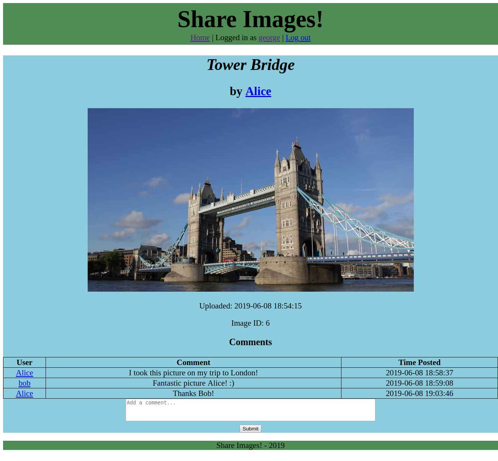

# Share Images! website

## Description

This website allows users to upload images which are then displayed on the website. Users are able to place comments on uploaded images. Each image has its own page that displays the image and all of the comments posted about it. Each user also has their own page displaying all of the images that they have uploaded and all of the comments that they have posted. A user can sign-up for an account on the sign-up page. A user must be logged-in to an account in order for them to upload images and place comments.

A version of the website is currently deployed on Heroku: https://sharing-images.herokuapp.com/

## Technical Details

- The web server is run using [Node.js](https://nodejs.org/en/) and the [Express](https://expressjs.com/) web framework.
- The [mustache](https://github.com/janl/mustache.js) template system is used to render the html for each page.
- The [multer](https://github.com/expressjs/multer) middleware package is used to upload files to the web server.
- [SQLite](https://github.com/mapbox/node-sqlite3) is used for the database.
- Authentication is achieved using cookies.
- User passwords are salted, hashed and stretched for security purposes using the [crypto](https://nodejs.org/api/crypto.html) module.
- A responsive web design was created using CSS. Media queries are used to determine the number of images to display in each row on the homepage.

## Running the Webserver

First, install all of the required node packages using the command:

```
npm install
```

Next, run the web server with the command:

```
npm start
```

Finally, visit the website at the url http://localhost:8080/


## Screenshots




